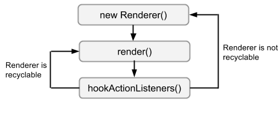

brender
=======

Simple, but powerful Renderer pattern implementation for Android Adapters.

Download
--------

### Bundle

Brender comes bundled in `aar` format. Grab the latest bundle from [here](http://search.maven.org/remotecontent?filepath=com/sefford/brender/1.0.3/brender-1.0.3.aar)

### Maven

```XML
<dependency>
    <groupId>com.sefford</groupId>
    <artifactId>brender</artifactId>
    <version>1.0.3</version>
    <type>aar</type>
</dependency>
```

### Gradle 

```groovy
compile 'com.sefford:brender:1.0.3@aar'
```

Why Renderers?
--------------

Renderer pattern decouples the actual models from their representation and encapsulates it on self-contained
classes. 

This reduces dramatically the code base for Adapters, as a large portion of the List and Grid Adapters
can be managed by the `RendererAdapter` on its own.

These `Renderers` are also easily testable as their casuistry is more encapsulated and the methods
can be tested separately. In fact they can be unit tested isolately much more faster than whole 
Adapters, you are advised to make a good use of [Robolectric](http://robolectric.org/), though.

Additionally they model very well the capabilities of the Android Layouts design, and can be extended,
composed and used poliformically. 

The basics
----------

### Implementing a Renderer

Implementing a Renderer is easy. Its lifecycle is very similar to the normal operation of setting a 
view on a normal activity. The default `RendererAdapter` will take most of the work and boilerplate.

The Renderer Lifecycle is as follows:



Brender library provides a basic template class for Renderers with the ID and a `Postable` element.
The Renderers are loosely coupled so the developer can extend their own via the AbstractRenderer
or implementing the `Renderer` interface.

### Renderer and Renderable IDs

A Renderer will be recyclable when the intended Renderer has the same `Renderer IDs`. 
  
Brender's default implementation will enforce IDs directly selected from *R.layout*. This has some
advantages: 

* Straightforward comparison of Renderers IDs for the RendererBuilders.
* Uniqueness of such IDs, so there are 1-1 relation between layouts and Renderers.

This reduces the code base and the necessity of redundant Renderers. 

These IDs are provided by the model classes by implementing `Renderable` interface.

### Instantiation of Renderers

The default implementation of Brender relies on a Builder element with fluent a API which takes
the boilerplate of instantiating the Renderers, as it works inside the `RendererAdapter`.

The developer will be able to delegate the actual creation of Renderers via injecting a `RendererFactory` interface
object to the Builder in construction time. The Builder itself has to be injected to the RendererAdapter,
so several Builders and Factories can persist on several points of the application.

### Communicating back to the UI

The Renderers make use of a `Postable` interface to communicate events to the UI. This design decision
was done in order to avoid lengthy signatures. 

This is intended to wrap an Event Bus and post events through it. [Square's Otto](http://square.github.io/otto) or [GreenRobot's EventBus](https://github.com/greenrobot/EventBus)
are highly recommended for this task.

### Extending Renderers functionality

In order to make the Renderers extensible to a variety of necessities, a configuration object known
as `extra` is passed down the Builder and the Factory. This object does not have any requisite and
it is up to the developer to decide on its implementation.

Typically this will allow to inject dependencies to the Renderer's constructor without having to extend
or modify the default Builder. The Builder and the Factory is generified, so the developer can choose
to cast the object or directly assign a type to both.

Additionally the developer can find the interfaces at `com.sefford.brender.interfaces` package to
build its own implementation of the Renderer pattern.

Advanced usage
--------------

### ButterKnife

[Jake Warthon's ButterKnife](http://jakewharton.github.io/butterknife/) is highly advised to provide comfortable mapViews() code reduction.
 
### Polymorphic views

Remember that as long as a layout has the *exact same views as another one* and is related to the same 
class of the model (i.e User), it is easy to extend one Renderer of another and simply assign it the
correct R.layout ID, producing a different effect and recycling 95% of the code.

### Compositing views

Some views are just built by `<include>` and `<merge>` XML tags. Try to encapsulate such views in layouts
so you can in the future use composition to build a customized Renderer that handles the view without
duplicating code.

In that sense if a view just is a superset of another one, recycle the code by injecting a Renderer
that handles the common elements and then delegate the rest on the new Renderer. Favor composition
over inheritance!

### Reusing views

You can reuse the same Renderer for two different classes of the model if you manage to implement a 
common interface on both.

### Model View Presenters

Renders can act as their own as a kind of Presenters. If you are using the same view for a list than
for a static layout, do not feel afraid to directly use a standalone Renderer to use the dirty work
for you!

On the other hand you can use your Presenters as the backbone for a Renderer, if you see it fit.

### Wait, there is more!

For more cool stuff on Renderers, try [Pedro Vicente's Renderer implementation](https://github.com/pedrovgs/Renderers).

License
-------
    Copyright 2014 Sefford.

    Licensed under the Apache License, Version 2.0 (the "License");
    you may not use this file except in compliance with the License.
    You may obtain a copy of the License at

       http://www.apache.org/licenses/LICENSE-2.0

    Unless required by applicable law or agreed to in writing, software
    distributed under the License is distributed on an "AS IS" BASIS,
    WITHOUT WARRANTIES OR CONDITIONS OF ANY KIND, either express or implied.
    See the License for the specific language governing permissions and
    limitations under the License.


